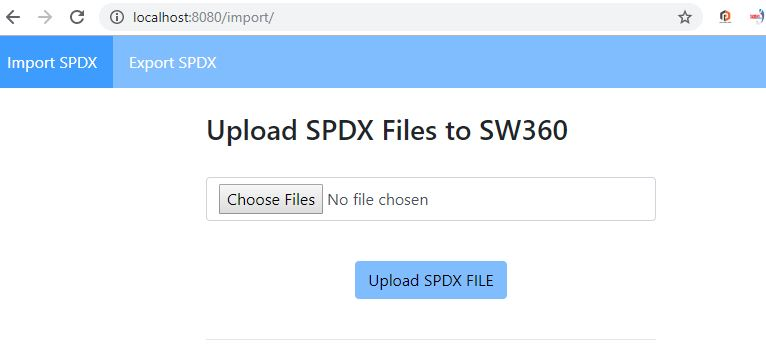

# SW360tools

The tools for importing SPDX into SW360tools and exporting information from SW360tools.

## Using SW360tools

For using the SW360tools, please see the following basic workflows:

    1. Basic workflow for importing component, release and license by SPDX file.
    2. Basic workflow for exporting component, release and license via SPDXlite file.
 
Basic workflows for importing component, release and license by SPDX file:

    In SW360tools, open the Import screen as follows:
	http://<host_ip>:8080/import
	

	Click on "Choose Files" button and select 1 or many files.

	Click on "Upload SPDX FILE" button.

	System dislays message.

Basic workflow for exporting component, release and license via SPDXlite file

	In SW360tools, open the Export screen as follows:
	http://<host_ip>:8080/import/export

	Select the field on the left hand side panel that you want to export and click ">" button. ">>" button will move all fields on the left panel to the right panel. All available fields will be exported.
	
	Select the field on the right hand side panel that you do not want to export and click "<" button. "<<" button will move all fields on the right panel to the left panel. No field will be exported.

	Click "Export SPDX lite" button. System will download SPDX lite file. Now, you can view the exported SPDX lite report:

	If there is no release on component, the export might export an empty Excel file. The reason is that SPDX data is stored on release and if there is no release, system has nothing to export.

	
## Deploying SW360tools

In order to install SW360tools, you can do as the following steps:

    1.	Java version
		We have tested with Java version is 1.8.0_221

	2.	Configure source code
		-	Configure setup with SW360 environment in file /import/src/main/resources/application.properties:
			sw360.user: Username login to SW360
			sw360.pass: Password login to SW360
			host.sw360: Host of SW360
 
		-	Configure path file on server /import/src/main/java/com/spdx/service/FileStorageImpl.java
			Change value of rootPathFile to folder in server where you will save temporary SPDX file.

	3.	Build project
		-	In folder source code \sourcecode\import, run command:
		$mvn clean

		$mvn install –Pdeploy

		-	"Import.war" is generated after "mvn install –Pdeploy"
		-	Copy file /home/sw360/oss-management/target/import.war to /home/sw360/liferay-portal-6.2-ce-ga5/deploy/
 	
	4. Start application SW360 and Import/Export Application:
		$/home/sw360/liferay-portal-6.2-ce-ga5/tomcat-7.0.62/bin/catalina.sh start

 

